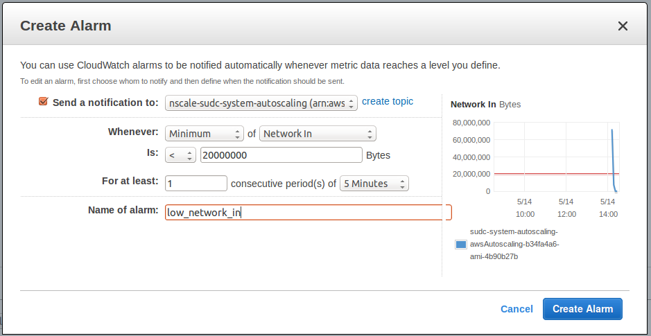

<a href='http://nscale.nearform.com'>![logo][]</a>

#AWS Auto Scaling
[Previous][previous] | [Home](./)

This tutorial covers:

1. How nscale auto scaling support works.
2. Deploying an auto scaling version of the SUDC system

## What is Auto Scaling?

Auto Scaling is a powerful feature which allows AWS to provision and deprovision additional instances based off user defined triggers (e.g. increased network load). This feature allows an system's architecture to scale and shrink as required. 

The difficulty lies in configuring the newly provisioned instances. Once a new instance goes online, how do we deploy our service(s) to it? Ideally, we want this to happen automatically. With clever usage of the [AWS SDK for Node.js][aws-sdk], nscale makes this easy to configure.

## How nscale Auto Scaling Support Works

 Upon deployment of an auto scaling system, nscale provisions the following services (As well as the system itself of course) 

 - Auto scaling group
 - Launch Configuration
 - Simple Notification Service (SNS) topic
 - Simple Queue Service (SQS) queue


The diagram below shows the message flow between nscale and the various services which allows us to support auto scaling.

<div align="center"></div>
<p align="center"><i>Flow diagram of nscale autoscaling support</i></p>

1. The autoscaling group is configured to publish auto scaling events to the SNS topic.
2. The SNS topic is configured to push the notifications to the SQS queue.
3. nscale listens for notifications from the SQS queue.
4. When the event occurs nscale performs a fix cycle which detects that the new instance(s) are not running containers.
5. The containers you have specified are deployed to the new instances.

<div align="center"></div>
<p align="center"><i>Event, Analyze, Fix: The nscale Auto Scaling Loop</i></p>

The one catch is that you must set up the auto scaling triggers/alarms yourself. This can be done easily in the AWS console.

## Setting up an Auto Scaling Group With nscale
If you haven't set up an nscale management server in AWS please follow the [previous][] exercise first.

Once again, let us turn our attention to the SUDC System to understand how it works. The two files of interest are `definitions/awsInfrastructure.js` and `system.js`.

### awsInfrastructure.js

The two container definitions of interest are awsAutoscaling and awsAMachine. (The names are arbitrary.)

```js
exports.awsAutoscaling = {
  type: 'aws-autoscaling',
  specific: {
    ImageId: 'ami-4b90b27b',
    MinSize: 2,
    MaxSize: 5
  }
};

exports.awsAMachine = {
  type: 'blank-container'
};
```
Let's step through this:

__awsAutoscaling__

- The specified container type is the nscale 'aws-autoscaling' module.
- In the specific field, base image id is specified. This should be the base docker image created in the [previous][] exercise.
- The MinSize and MaxSize are self explanatory.

__awsAMachine__
- This is simply specified as a 'blank-container'
- It represents the root container or instance which will have containers deployed to it.

### system.js

This is where the autoscaling topology is defined .

```js
autoscaling: {
    awsWebElb: [{
      awsWebSg: [{
        awsAutoscaling: {
          awsAMachine: ['web', 'doc', 'hist', 'real']
        }
      }]
    }]
  },
```
Here the topology is defined in a similar mannner to the previous aws topology.
- Instead of specifiying awsMachine containers inside the awsWebSg container, we specify the awsAutoScaling container.
- Inside this we specify the 'blank' awsMachine container which is where the services will be deployed.

### config.js
Open `config.js` (`config.example.js` if you haven't done the [previous][] exercise) it should look similar to this:

```js
module.exports = {
  region: 'us-west-2',
  identityFile: "key.pem",
  accessKeyId: "YOUR_KEY_HERE",
  secretAccessKey: "YOUR_SECRET_HERE",
  user: "ubuntu",
  defaultSubnetId: "subnet-xxxxxxxx",
  defaultVpcId: "vpc-xxxxxxxx"
  defaultImageId: "ami-xxxxxxxx",
  defaultInstanceType: "t2.small",
  defaultKeyName: "YOUR_AWS_KEY_ID_HERE"
};
```
Ensure the correct information is specified and that the file is saved as `config.js`.

## Deploy

First compile the system:

```bash
nscale system compile sudc
```

Build the containers:

```bash
nscale container buildall sudc autoscaling
```

Deploy the system:

```bash
nscale revision deploy sudc latest autoscaling
```
This will take a few minutes. Once the deployment process is complete you should see two instances up and runnning in the AWS console. If you point your browser to the ELB domain you will see the SUDC application.

## Set up the Triggers

In the EC2 console, go to the auto scaling groups. You should see one with a name similar to `sudc-system-autoscaling-awsAutoscaling-b34fa4a6-ami-4b90b27b`.
Click the scaling policies tab and you will see two policies.

<div align="center"></div>

Let's create some basic alarms for both of these. For demonstration purposes we will use unrealistic (but easy to test!) metrics.

### nscale-scaling-down

Create an alarm and use the following configuration:

<div align="center"></div>

Ensure that the notification is being sent to the SQS queue named 'nscale-sudc-system-autoscaling'.

After the alarm is created configure the nscale-scaling-down policy to wait for 60 seconds before allowing another acitvity.

### nscale-scaling-up

Create an alarm and use the following configuration:

<div align="center"></div>

Ensure that the notification is being sent to the SQS queue.

Configure the policy to wait for 60 seconds before allowing another acitvity.

To recap - Your configuration should look like this:

<div align="center"></div>

## Load Test
There are plenty of tools out there for doing all kinds of load testing. For simplicity we will just bombard the index page with requests using [Apache Benchmark.][ab] This can be done from the management server.

```bash
sudo apt-get install apache2-utils
```
and then run the following command:

```bash
ab -n 1000000 -c 200 http://<your-aws-elb-domain-name.com>/
```
This will simulate 1000000 requests from 200 concurrent users. This will run for a few minutes.

Go to the auto scaling group and click on the scaling history tab. You will see the two events for the provisioning of the original instances already.
Hit the refresh button every 30 seconds or so and eventually you will see some activity.

You will be able to see the instances spinning up and being torn down.

during this time

After all events have completed the full history should look like similar to the following:

<div align="center"></div>

That's AWS auto scaling support on nscale! Unless you have money to burn, ensure you tear down your instances and delete the auto scaling group. 
Now that you're a master, why not [contribute][] to nscale?

[Previous][previous] | [Home](./)

[previous]: ./8-deploy-to-aws.md
[contribute]: ../contributing/README.md
[ab]: http://httpd.apache.org/docs/2.2/programs/ab.html
[autoscaling]: ./img/autoscaling.png
[autoscaling-loop]: ./img/autoscaling-loop.png
[scaling-policies]: ./img/scaling-policies.md
[aws-sdk]: http://aws.amazon.com/sdk-for-node-js/
[logo]:../_imgs/logo.png
